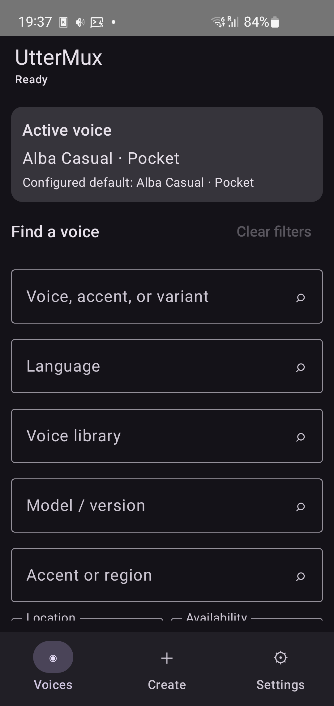
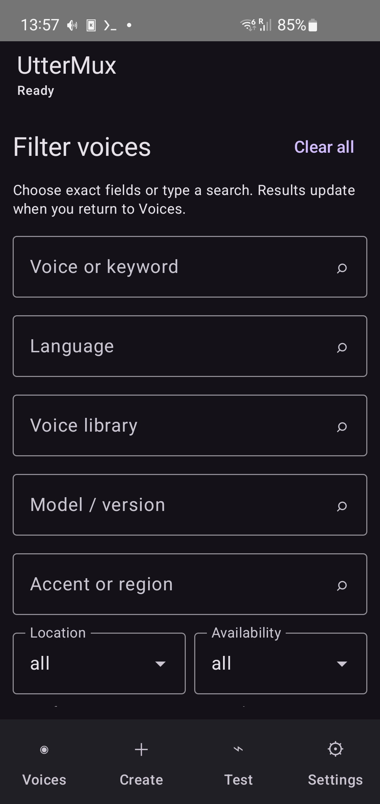
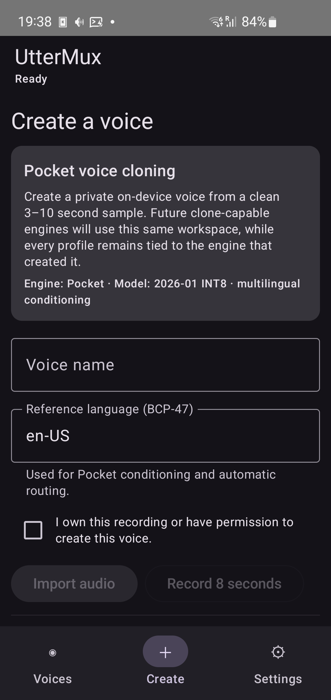
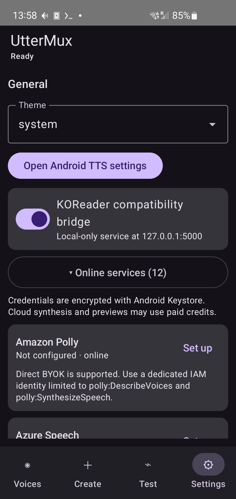

# UtterMux for Android


[](https://github.com/anaxonda/uttermux-android/actions/workflows/android.yml)

UtterMux is an Android system text-to-speech engine and voice manager. It gives
applications one standard `TextToSpeechService` interface for local models and
online providers. An optional localhost PCM adapter supports clients that do
not use Android's system TTS API.

The companion [Linux broker and Speech Dispatcher backend](https://github.com/anaxonda/uttermux-linux)
uses the same catalog contract and routing concepts.

> **Status:** beta. No model weights are bundled. Local artifacts are downloaded
> only after the user selects Download.

| Voice catalog | Dedicated filters | Voice creation | Settings and providers |
| --- | --- | --- | --- |
|  |  |  |  |

## What works

- Android `TextToSpeechService` integration for applications using the standard
  system API.
- Embedded eSpeak NG runtime and language data for compact, multilingual
  offline speech with no voice download.
- Early `onStart`, adaptively reserved incremental PCM delivery, exact text
  ranges, cancellation, engine warming, segmented Piper synthesis, and bounded
  silence trimming.
- A pre-indexed, debounced voice catalog with one global voice search and a
  searchable, single-select screen for every filter dimension; dependent result
  counts; availability, location,
  capability, cost, performance, gender, size, and speed controls; one-tap
  clearing; exact-voice previews;
  ordered BCP-47 fallback routes, model downloads, settings, and diagnostics.
- Full Piper catalog (174 models and 2,707 speaker choices), all 53 Kokoro 1.0
  speakers, the 103-speaker Kokoro 1.1 FP32 option, all eight Kitten speakers,
  Inflect, Matcha, and Supertonic.
  Kokoro and Kitten can be auditioned before downloading via Hayai's per-speaker
  sample catalog. Pocket includes ten reference voices and can create private
  profiles from imported audio or an eight-second microphone recording.
- Edge, ElevenLabs, Grok/xAI, OpenAI-compatible, Azure, Qwen/DashScope,
  Deepgram, Cartesia, PlayHT, Resemble, Google Cloud, AWS Polly, and a constrained
  custom PCM provider. Google accepts a restricted API key or proxy. AWS accepts
  direct SigV4 credentials, Cognito temporary credentials, or a proxy.

The Linux documentation defines the shared, audited request contracts for
[authentication, discovery, language, rate, audio, and proxy behavior](https://github.com/anaxonda/uttermux-linux/blob/main/docs/cloud-providers.md).
Platform adapters follow those contracts; a control is explicitly reported as
unsupported when the selected provider API does not offer it.

Paid cloud providers are never inserted as implicit fallbacks. Add them to a
language route explicitly. API keys are encrypted with Android Keystore and are
excluded from backup and device transfer.

## App navigation

- **Voices** shows the active voice, a global search field, result count, voice
  cards, and only the filters currently in use. The **Filter** menu chooses a dimension; each
  dimension opens a full-screen searchable chooser rather than a popup list.
  Choosers show conditional voice counts, alphabetical/count sorting for large
  lists, and single selection. Location uses Offline/Online consistently with
  the desktop app.
- **Create** records or imports a permitted reference sample for Pocket or the
  Qwen device-preview runtime, previews source and generated audio, and manages
  engine-specific private profiles.
- **Test** previews installed local voices and benchmarks each exact model
  artifact on the current device. An installed voice card's **Test model**
  button opens this page with that artifact first. A tested voice can be made
  active directly from the same card.
- **Settings** contains general integration, individually expandable online
  service cards, language routing, downloaded-model storage, explained advanced
  playback controls, diagnostics, and privacy/version information.

Filters and list position survive tab changes and rotation but intentionally
start clean after a complete process relaunch.

## Models available in the Android app

Every row below has an implemented Android synthesis path. Neural models require
an explicit download; eSpeak NG ships as the compact runtime and language-data
fallback. Sizes and RAM are catalog
metadata and can change when upstream artifacts change; they are not universal
hardware requirements.

### Cross-platform local support

“Yes” means the released app exposes an install and synthesis path. “Profile”
means a reference recording must be configured before a system voice exists.

| Family | Android | Linux | Current boundary |
| --- | --- | --- | --- |
| eSpeak NG | Embedded runtime; 100+ languages/accents | Installed system engine | Formant synthesis; no model download |
| Piper/VITS | Yes; generated pinned catalog | Yes; generated pinned catalog | Fixed voices |
| Inflect Nano/Micro | Nano and Micro | Nano | Fixed English voices |
| Kitten | FP16 v0.1 and INT8 v0.8 | FP16 v0.1 and INT8 v0.8 | Fixed English voices |
| Matcha | Yes | Yes | LJSpeech + Vocos artifact |
| Supertonic 3 | INT8 | INT8 | Multilingual styles |
| Pocket | Yes; presets and profiles | Yes; presets and profiles | Reference-conditioned cloning |
| Kokoro | v1.0 and v1.1 FP32 | v1.0 FP32 | INT8 and FP8 are not included |
| ZipVoice Distill | No | Profile; INT8 | Linux requires reference audio and transcript |
| MOSS-TTS-Nano | FP32; explicit heavy/experimental download | Companion adapter; FP32 | Runnable; benchmark before sustained reading |
| Qwen3-TTS 0.6B | Base Q4_K_M device preview; profiles | Companion adapter; CustomVoice | Separate runtimes sharing catalog metadata |

| Concrete artifact | Languages / voices | Clone | Download | Precision | Est. RAM | 2019 SM-G970F result | Upstream |
| --- | --- | ---: | ---: | --- | ---: | --- | --- |
| Piper/VITS dynamic index | 174 packages; 2,707 choices; 50+ languages | No | package-specific | FP32/INT8 by package | package-specific | Tested; Alan Low is the continuity baseline | [Piper](https://github.com/OHF-Voice/piper1-gpl) |
| `vits-inflect-en-nano-v2` | English; 1 | No | 17 MiB | FP32 | 80 MiB | Runnable; no isolated timing recorded | [Inflect Nano](https://huggingface.co/owensong/Inflect-Nano-v2) |
| `vits-inflect-en-micro-v2` | English; 1 | No | 43 MiB | FP32 | 120 MiB | Runnable; no isolated timing recorded | [Inflect Micro](https://huggingface.co/owensong/Inflect-Micro-v2) |
| `kitten-nano-en-v0_1-fp16` | English; 1 | No | 26 MiB | FP16 | 120 MiB | Runnable; no isolated timing recorded | [KittenTTS](https://github.com/KittenML/KittenTTS) |
| `kitten-nano-en-v0_8-int8` | English; 8 | No | 31 MiB | INT8 | 120 MiB | RTF ~0.80 | [KittenTTS](https://github.com/KittenML/KittenTTS) |
| `matcha-icefall-en_US-ljspeech` | English; 1 | No | 77 MiB | FP32 | 260 MiB | Runnable; sustained reader test pending | [Matcha-TTS](https://github.com/shivammehta25/Matcha-TTS) |
| `sherpa-onnx-supertonic-3-tts-int8-2026-05-11` | 31 languages; 10 styles | No | 129 MiB | INT8 | 350 MiB | Runnable; sustained reader test pending | [Supertonic](https://github.com/supertone-inc/supertonic) |
| `sherpa-onnx-pocket-tts-int8-2026-01-26` | English; 10 references + profiles | Yes | 176 MiB | INT8 | 420 MiB | Two-step sustained warm RTF ~0.47–0.48; client boundaries may remain audible | [Pocket TTS](https://github.com/kyutai-labs/pocket-tts) |
| `kokoro-multi-lang-v1_0` | English/Chinese runtime; 53 speakers | No | 350 MiB | FP32 | 650 MiB | Same heavy family as measured v1.1; benchmark required for continuous reading | [Kokoro](https://k2-fsa.github.io/sherpa/onnx/tts/pretrained_models/kokoro.html) |
| `kokoro-multi-lang-v1_1` | English/Chinese; 103 speakers | No | 348 MiB | FP32 | 700 MiB | Runnable; same heavy tier, not separately timed | [Kokoro v1.1](https://k2-fsa.github.io/sherpa/onnx/tts/all/Chinese-English/kokoro-multi-lang-v1_1.html) |
| `moss-tts-nano-100m-onnx` | 20 languages; 18 presets | No | 728 MiB | FP32 | ~1.4 GiB | Runnable but RTF ~1.41–1.47; exposed only for substantially faster devices | [MOSS-TTS-Nano](https://github.com/OpenMOSS/MOSS-TTS-Nano) |
| `qwen3-tts-0.6b-base-q4km` | 10 languages; user profiles | Yes | 843 MiB | Q4_K_M GGUF | ~1.54 GiB measured PSS | Device preview; the Galaxy S10 benchmark produced no first audio within 4 min 19 s | [Qwen3-TTS](https://github.com/QwenLM/Qwen3-TTS) / [qwen3-tts.cpp](https://github.com/Danmoreng/qwen3-tts.cpp) |

Kokoro v1.1 INT8 exists upstream but is not included because the tested
Android/ARM path produced intermittent rail-pinned audio and regressions.
UtterMux has no tested Kokoro FP8 artifact or FP8 Android runtime configuration.
This does not imply that FP8 is impossible on other devices or execution
providers. A model variant enters the app only after the artifact and runtime
pass synthesis and reader tests together.

## Evaluated models not included in the Android app

The models in this section are **not supported by this release**: they do not
appear in search, cannot be downloaded by the app, and cannot be selected as an
Android system voice. The table records why they were evaluated and what would
be required before adding them. Passing initialization alone is insufficient;
an arm64 implementation must pass exact system-TTS ranges, cancellation, peak
memory, sustained RTF, and multi-client reader tests.

| Model | Main value | Available deployment path | Evaluation hardware | UtterMux status |
| --- | --- | --- | --- | --- |
| [ZipVoice Distill](https://github.com/k2-fsa/ZipVoice) | English/Chinese zero-shot cloning | sherpa-onnx Android | recent midrange or faster | Not integrated; system voice requires reference audio and exact transcript |
| [Chatterbox Nano](https://huggingface.co/ResembleAI/chatterbox-nano) | English cloning | PyTorch upstream; community ONNX work | current flagship | No accepted maintained arm64 runtime |
| [NeuTTS Nano](https://github.com/neuphonic/neutts) | multilingual per-model cloning | GGUF backbone + ONNX codec | current flagship | Custom runtime and reader acceptance tests required |
| [Audio8 0.6B INT4](https://github.com/Audio8-AI/Audio8_TTS) | multilingual cloning/streaming | official CPU ONNX package | 6–8 GiB current flagship | Android ARM benchmark and service integration required |
| [LEMAS-TTS](https://github.com/LEMAS-Project/LEMAS-TTS) | multilingual cloning | ONNX assets; limited mobile integration | current flagship | No accepted Android runtime |
| [X-Voice](https://github.com/sunnyxrxrx/X-Voice) | cross-lingual cloning | PyTorch-oriented | current flagship | Checkpoint is CC-BY-NC-4.0; not a normal distributable app model |
| [OmniVoice](https://github.com/k2-fsa/OmniVoice) | 600+ language zero-shot synthesis | no accepted Android deployment | unassigned | No accepted Android runtime |

## Online services

| Service | Authentication | Voice discovery / preview |
| --- | --- | --- |
| Edge Read Aloud | none | live locale catalog; unofficial endpoint |
| ElevenLabs | API key | account voice catalog; metered preview |
| xAI / Grok | API key | provider voices; metered preview |
| OpenAI-compatible | API key, endpoint, model | configured endpoint |
| Azure Speech | resource key and region/endpoint | Azure voice catalog |
| Qwen / DashScope | API key, region, optional workspace | DashScope voices |
| Google Cloud TTS | restricted API key or proxy | Google voice catalog |
| Amazon Polly | SigV4, Cognito temporary credentials, or proxy | Polly voice catalog |
| Deepgram, Cartesia, PlayHT, Resemble | provider credentials | provider-specific catalog |
| Custom PCM | HTTPS endpoint and bearer token | configured voice ID |

## Build and install

```sh
git clone --recurse-submodules https://github.com/anaxonda/uttermux-android
cd uttermux-android
export JAVA_HOME=/usr/lib/jvm/java-17-openjdk
export ANDROID_HOME=$HOME/Android/Sdk
unset ANDROID_SDK_ROOT
./gradlew testIsolatedHostUnitTest assembleDebug assembleIsolatedHostAndroidTest lintDebug
adb install -r app/build/outputs/apk/debug/app-debug.apk
```

Select UtterMux under Android's text-to-speech settings, then open UtterMux to
install a local voice or configure a cloud provider. Instrumentation targets
the separate `io.uttermux.android.testhost` application and the runner refuses
to execute against the live package. The wrapper installs that isolated host
and invokes a selected deterministic test:

```sh
scripts/device-test.sh
scripts/device-test.sh io.uttermux.android.PiperPreviewTest
```

UtterMux deliberately ships with **no neural voice model in the APK**. The
embedded eSpeak NG runtime provides a ready offline fallback at first launch;
every neural model remains an explicit, separately licensed download.

## Shared catalog

The reviewed catalog source and deterministic generator live in
[`uttermux-linux`](https://github.com/anaxonda/uttermux-linux/tree/main/catalog).
This repository commits the generated schema-2 JSON used by Android builds.
Families, runnable variants, voices, and artifacts are separate records, so
Linux and Android can use different runtimes for one model family without
presenting unsupported rows on either platform. The build validates the schema
and requires the pinned Android Qwen device-preview variant.

`catalog.lock.json` records the exact Linux commit, catalog SHA-256, and source
provenance. Android CI validates it offline. A daily, manually dispatchable
workflow checks Linux `main`; when the catalog changes it validates the new
catalog and opens or updates a reviewable Android pull request. Android builds
never download a mutable catalog.

Cloud catalogs are different: account, region, and API changes make a committed
voice snapshot stale. Each provider adapter discovers its live voices and
overlays credential/readiness state at runtime. See the Linux project's
[catalog architecture](https://github.com/anaxonda/uttermux-linux/blob/main/docs/CATALOG.md).

## Adaptive streaming

UtterMux prepares a route before starting, tells Android the fixed output format
(24 kHz, mono, signed PCM16) immediately, and emits audio as soon as its provider
can produce it. Local VITS/Piper text is split on semantic boundaries and the
engine is retained in a small LRU cache. Generation, decoding, and playback are
independent. Playback owned by the optional localhost adapter uses a PCM-duration-bounded
producer/consumer queue whose startup reserve adapts to measured real-time
factor and underruns, including changes caused by thermal throttling.

A route may fall back only before it has emitted audio. This avoids switching
voices in the middle of an utterance. Language routes use exact BCP-47 matches,
then base-language matches, then the global default and local-only safe
fallbacks.

## Legacy localhost compatibility adapter

Android applications normally use UtterMux through `TextToSpeechService` and do
not need this adapter. For clients that require the older localhost protocol,
enable the compatibility server in UtterMux and install `TTS.koplugin` under
`/sdcard/koreader/plugins/`. The server binds only IPv4 loopback at
`127.0.0.1:5000` and implements `/voices`, `/`, `/play`, `/stop`, `/remaining`,
`/pause`, `/resume`, and `/health`. Synthesis and playback are concurrent, so
KOReader no longer
waits for a complete passage before hearing audio.

Android pause/resume and UTF-8-safe ebook normalization require the maintained
[`koreader/uttermux-v2.patch`](koreader/uttermux-v2.patch). The patch preserves
the current server handle across Pause/Play, orders the localhost pause request,
and removes legacy Windows-1252 byte substitutions which corrupt UTF-8 curly
apostrophes into spoken “TM.” See [`koreader/README.md`](koreader/README.md) for
the compatibility contract. The desktop bridge uses position-preserving
`/stop` and must not receive the Android `/pause` portion unchanged.

## Model policy

Only models in **Models available in the Android app** appear in the voice
catalog. Entries under **Evaluated models not included** are documentation only.
Local model downloads require an explicit install action.
Pocket reuses one runtime/model with cached reference WAV files. Its one-to-five-step
quality selector trades generation latency for refinement. Automatic thread selection
uses at most two threads for Pocket and four for other local engines, bounded by the
device's available cores. Two Pocket steps are the fresh quality default; the
figures below are measurements from the named Galaxy S10 benchmark, not a
universal optimum. Kokoro uses the supported FP32 graph: the available
INT8 export is intentionally hidden because current ARM reports include rail-pinned
audio, tones, and performance regressions. The official MOSS FP32 graph remains
available as an explicit heavy/experimental download for faster hardware; it is
never selected as an automatic fallback. ZipVoice remains excluded because it
requires a reference recording plus transcript and has no preset-voice catalog
suitable for the current system-TTS UX.

Qwen Base Q4_K_M is visible as a **device preview**: its pinned arm64 runtime,
download, cancellation, streaming callback, and profile path are implemented,
but it is excluded from automatic fallback until sustained-reader benchmarks
establish suitable hardware. Audio8, Chatterbox, NeuTTS, LEMAS, X-Voice, and
OmniVoice remain documentation-only candidates.

In the documented Galaxy S10 run, model download and verification took 67.9
seconds. The process reached approximately 1.5 GiB PSS. A clone synthesis capped
at 128 audio tokens (at most about 10.7 seconds of output at 12 Hz) was terminated
after 4 minutes 19 seconds without producing its first streaming callback, with
about 1.54 GiB PSS and 752 MiB swap PSS. The prepared speaker embedding was
successfully extracted and loaded before generation; profiles now store it as
JSON because the pinned upstream binary loader can misclassify arbitrary float
bytes containing `[` as JSON.
This gives a lower-bound RTF well above 17 and also means callback-only
cancellation cannot interrupt the expensive first generation window. That
artifact/runtime/hardware combination does not meet UtterMux's continuous
reading target; the result is not a general classification of Qwen or newer
Android hardware.

## Cloud credentials and proxy contract

Google Cloud can use a Google API key restricted to the Text-to-Speech API and
the Android app. AWS can sign Polly requests locally with a least-privilege IAM
key, obtain temporary credentials from a Cognito identity pool, or use a proxy.
Direct secrets are encrypted with Android Keystore and excluded from backup.
The settings screen can copy the minimal Polly IAM policy. Cognito avoids a
permanent AWS secret on the phone and is preferred for a client-only deployment.

A compatible proxy exposes:

- `GET /v1/voices`: JSON array containing at least `id` and `language`.
- `POST /v1/synthesize`: JSON request containing voice, language, and text;
  response body is 24 kHz mono PCM16.

The custom endpoint is deliberately constrained to this PCM contract. The
OpenAI-compatible provider separately supports a configurable base URL and
model for APIs implementing OpenAI's speech endpoint.

## Device tuning and model variants

The **Test** tab benchmarks installed local artifacts only. Preview first to
check pronunciation and audio quality; the voice row and app bar show whether
the preview is still generating or is already playing. Then press **Benchmark**
to run the measured sweep. Its standard sweep
tests one through four threads; Android's logical-core count does not distinguish
performance cores from efficiency cores, and wider heavy-model sweeps can regress
severely. Each version and
precision is independent: FP32, FP16, INT8, and GGUF artifacts never share
results. The sweep records cold and warm first-audio latency, RTF, process
memory, simulated underruns, and thermal state, then proposes the smallest
thread count within 5% of the fastest result. Nothing is applied until the user
confirms.

Applied profiles are bound to a combined catalog-artifact and app-runtime
fingerprint, and are ignored after either changes. **Test & tune → Model
settings** exposes only controls consumed by that artifact's runtime: threads
and generated-silence scaling for sherpa models, Pocket refinement and decoder
chunk size, and ZipVoice generation steps. Precedence is: an active benchmark run, a manual model
override, a valid tuned profile, the global default, then Automatic. Playback
buffering and the loaded-model cache remain global. Pocket refinement and other
quality controls are never changed by the benchmark.

Variants from one family appear together with their version, quantization,
storage, memory, and last result. Preview each installed variant with identical
text before choosing a default: performance metrics cannot detect pronunciation
errors or degraded voice quality. Benchmarking does not download models.

Model installation needs room for the archive, extracted files, and Android's
working reserve. On the development Galaxy S10, 2.5 GiB free is treated as low
storage; clear at least 5 GiB, preferably 8–10 GiB, before multi-model testing.

## Verification

The release test suite covers exact segmentation/ranges, PCM conversion and
silence trimming, adaptive buffering policy, routing, model management, text
normalization, unsafe-output rejection, and system-TTS compatibility. On the development
Samsung SM-G970F, Alan Low produced first audio in about 2.1 seconds cold and
0.33 seconds warm while completing through Android's system TTS callback.

Instrumentation uses the separate `io.uttermux.android.testhost` application.
Its runner refuses to target the live package, and deterministic callback tests
use test-host-only generated PCM. Network and large-model tests require an
explicit opt-in annotation, so the ordinary connected suite neither downloads
models nor depends on provider availability.

### Galaxy S10 development benchmark

The benchmark device is a 2019 Samsung Galaxy S10 SM-G970F (Exynos 9820,
Android 12, about 5.5 GiB usable RAM). It is a low-spec acceptance target by
2026 standards, not a representative current flagship. RTF is generation time
divided by generated audio duration; below 1.0 is faster than realtime. These
are local engineering measurements, not upstream claims.

| Model | Measurement | Storage / process observation | Reader conclusion |
| --- | --- | --- | --- |
| Piper Alan Low | ~2.1 s first audio cold; ~0.33 s warm | model-dependent | Best tested continuity |
| Kitten Nano INT8 | ~2.95 s generation for ~3.70 s audio, RTF ~0.80 | ~45 MB installed in the tested package | Realtime-capable |
| Inflect Nano v2 FP32 | repeated tuned RTF 0.176–0.250; 2.16–3.08 s median first PCM | 227–338 MB peak PSS | One thread selected; comfortably faster than realtime |
| Pocket INT8, 2 steps | RTF 0.569/0.584/1.021/1.152 at 1/2/3/4 threads | 642 MB peak PSS | One thread selected; wider phone parallelism regresses sharply |
| Kokoro v1.0 FP32 | RTF 1.239/1.116/1.107/1.320 at 1/2/3/4 threads | 923 MB peak PSS | Two threads selected within the 5% band; still marginal for continuous reading |
| MOSS INT8 evaluation | sustained RTF ~1.41–1.47 | conversion removed | Not exposed; official FP32 remains an explicit heavy download |

Measurements use short fixed passages after a clean install and again with a
warm engine. Sustained reader acceptance also requires repeated section
requests, cancellation, pause/resume, and thermal observation; a good first-PCM
number alone is not sufficient.

Opt-in large-model tests also download, checksum, initialize, synthesize, and
exercise repeated provider requests. Because readers
such as Librera submit the next section only after the previous Android TTS
request completes, that per-request generation time still becomes an audible
section gap; UtterMux cannot pre-generate text the client has not supplied.
A localhost-adapter regression test now plays the same Pocket section twice
and waits for AudioTrack's actual playback head, covering stale-stream reuse and
clipped section tails. These tests are excluded from the ordinary suite because
they consume substantial bandwidth, storage, and time.

Run the argument-driven benchmark against any installed voice:

```sh
adb shell am instrument -w \
  -e class io.uttermux.android.ModelBenchmarkTest#benchmarkInstalledVoice \
  -e voice sherpa/sherpa-onnx-pocket-tts-int8-2026-01-26/alba-casual@en-US \
  -e runs 3 \
  io.uttermux.android.test/androidx.test.runner.AndroidJUnitRunner
adb logcat -d -s UtterMuxBenchmark:I
```

The JSON log reports device/SoC, voice ID, model, wall time, generated duration,
RTF, and process PSS for every run. It excludes playback. Run 1 includes model
loading only if the test process did not already cache that model. It does not
control thermal state, CPU governor, charging state, or background load.

### Newer-phone model scope

Kokoro FP32 is functionally compatible with the benchmark Galaxy S10; its
measured RTF misses the sustained-reading target. A recent high-performance ARM phone may make it a
continuous-reading choice, but UtterMux does not infer that from RAM or core
count alone. Qwen3-TTS 0.6B, Audio8 0.6B INT4, ZipVoice, and other heavyweight
families require a maintained arm64 runtime plus measured cold/warm latency,
sustained RTF, peak PSS, cancellation, and multi-client tests before they can
enter the runnable catalog. A hardware label will remain advisory and will not
download or hide models.

## Release channels

GitHub tag builds produce a signed arm64 APK after unit, lint, provenance, and
payload audits. The repository currently carries checksum-pinned development
builds of sherpa-onnx JNI and ONNX Runtime. F-Droid submission remains blocked
until its recipe rebuilds both native libraries from pinned source instead of
packaging those checked-in binaries.

## Related work

- [sherpa-onnx](https://github.com/k2-fsa/sherpa-onnx) provides the common JNI
  runtime and local model exports.
- [HayaiTTS](https://github.com/HayaiApp/HayaiTTS) is a similar offline Android
  system engine with a broad sherpa-onnx catalog and per-speaker samples.
- [NekoSpeak](https://github.com/siva-sub/NekoSpeak) informed the adaptive
  producer/consumer PCM pipeline and underrun handling.
- [Read Aloud](https://github.com/ken107/read-aloud) informed cloud-provider
  discovery, authentication, and proxy tradeoffs.
- [qwen3-tts-android](https://github.com/Danmoreng/qwen3-tts-android) is a
  reference for local quantized Qwen deployment; UtterMux does not embed it.
- [qwen3-tts.cpp](https://github.com/Danmoreng/qwen3-tts.cpp) supplies the
  GGML/GGUF runtime and JNI API used by UtterMux's gated Qwen experiment.
- [qwen3-tts-apple-silicon](https://github.com/kapi2800/qwen3-tts-apple-silicon),
  [qwen3-tts](https://github.com/gabriele-mastrapasqua/qwen3-tts), and
  [swift-qwen3-tts](https://github.com/AtomGradient/swift-qwen3-tts) document
  independent MLX/Metal deployment paths on M-series Macs.
- [PocketTTS.cpp](https://github.com/VolgaGerm/PocketTTS.cpp) and
  [speech-android](https://github.com/soniqo/speech-android) are reference
  implementations for pipelined Pocket inference and bounded Kokoro turns.

The project is GPL-3.0-or-later. The pinned sherpa-onnx JNI wrapper and native
libraries are Apache-2.0 components from k2-fsa; individual voice/model licenses
are displayed in the catalog.
